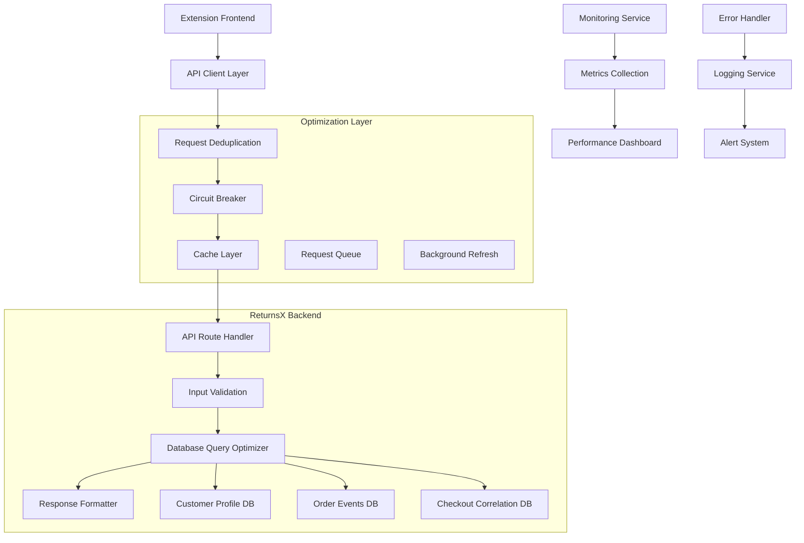
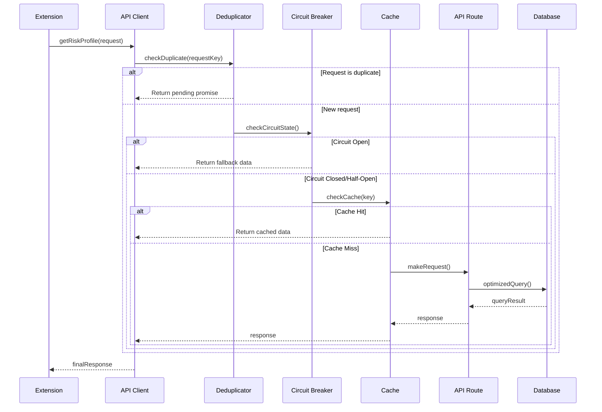

# Design Document

## Overview

The API Debugging and Optimization system addresses critical issues in the Shopify extension's order data retrieval mechanism. The current implementation suffers from multiple redundant API calls, inconsistent response codes (404, 200, 2020), and unpredictable behavior when fetching customer profiles.

This design implements a comprehensive solution featuring request deduplication, intelligent caching, circuit breaker patterns, and robust error handling to ensure reliable, single-call API interactions while maintaining compatibility with the existing ReturnsX thank-you page extension architecture.

## Architecture

### System Overview



### Request Flow Optimization



## Components and Interfaces

### 1. Request Deduplication Service

```typescript
interface RequestDeduplicator {
  // Generate unique key for request deduplication
  generateRequestKey(params: RequestParams): string;
  
  // Check if request is already in progress
  isDuplicateRequest(key: string): boolean;
  
  // Register new request and return promise
  registerRequest<T>(key: string, requestFn: () => Promise<T>): Promise<T>;
  
  // Clean up completed requests
  cleanup(): void;
}

interface RequestParams {
  checkoutToken?: string;
  customerPhone?: string;
  orderName?: string;
  orderId?: string;
}

class ApiRequestDeduplicator implements RequestDeduplicator {
  private pendingRequests: Map<string, Promise<any>>;
  private requestTimestamps: Map<string, number>;
  private readonly CLEANUP_INTERVAL = 5 * 60 * 1000; // 5 minutes
}
```

### 2. Enhanced Circuit Breaker

```typescript
interface CircuitBreakerConfig {
  failureThreshold: number;      // Number of failures before opening
  recoveryTimeout: number;       // Time before attempting recovery
  monitoringWindow: number;      // Time window for failure counting
  halfOpenMaxCalls: number;      // Max calls in half-open state
  successThreshold: number;      // Successes needed to close circuit
}

interface CircuitBreakerState {
  state: 'CLOSED' | 'OPEN' | 'HALF_OPEN';
  failureCount: number;
  lastFailureTime: number;
  nextAttemptTime: number;
  halfOpenCallCount: number;
  halfOpenSuccessCount: number;
}

class EnhancedCircuitBreaker {
  private config: CircuitBreakerConfig;
  private state: CircuitBreakerState;
  private metrics: CircuitBreakerMetrics;
  
  async execute<T>(operation: () => Promise<T>): Promise<T>;
  getState(): CircuitBreakerState;
  getMetrics(): CircuitBreakerMetrics;
  reset(): void;
  forceOpen(): void;
  forceClose(): void;
}
```

### 3. Intelligent Cache Layer

```typescript
interface CacheEntry<T> {
  data: T;
  timestamp: number;
  ttl: number;
  accessCount: number;
  lastAccessed: number;
}

interface CacheConfig {
  defaultTTL: number;           // Default time-to-live
  maxSize: number;              // Maximum cache entries
  backgroundRefreshThreshold: number; // Refresh when TTL < threshold
  compressionEnabled: boolean;   // Enable data compression
}

class IntelligentCache {
  private cache: Map<string, CacheEntry<any>>;
  private config: CacheConfig;
  private backgroundRefreshQueue: Set<string>;
  
  get<T>(key: string): T | null;
  set<T>(key: string, data: T, customTTL?: number): void;
  invalidate(key: string): void;
  clear(): void;
  getStats(): CacheStats;
  
  // Background refresh for frequently accessed data
  private scheduleBackgroundRefresh(key: string): void;
  private performBackgroundRefresh(key: string): Promise<void>;
}
```

### 4. Optimized Database Query Layer

```typescript
interface QueryOptimizer {
  // Optimize customer lookup queries
  findCustomerByIdentifiers(params: CustomerLookupParams): Promise<CustomerProfile | null>;
  
  // Optimize order event queries with proper indexing
  findOrderEvents(orderId: string): Promise<OrderEvent[]>;
  
  // Optimize checkout correlation queries
  findCheckoutCorrelation(token: string): Promise<CheckoutCorrelation | null>;
  
  // Batch multiple queries for efficiency
  batchQuery(queries: QueryBatch[]): Promise<QueryResult[]>;
}

interface CustomerLookupParams {
  phone?: string;
  email?: string;
  orderId?: string;
  checkoutToken?: string;
}

interface QueryBatch {
  type: 'customer' | 'order' | 'correlation';
  params: any;
  priority: 'high' | 'medium' | 'low';
}

class DatabaseQueryOptimizer implements QueryOptimizer {
  private connectionPool: DatabasePool;
  private queryCache: Map<string, any>;
  private preparedStatements: Map<string, PreparedStatement>;
  
  // Implement optimized queries with proper indexing
  async findCustomerByIdentifiers(params: CustomerLookupParams): Promise<CustomerProfile | null> {
    // Use prepared statements and query optimization
    // Implement proper error handling and connection management
  }
}
```

### 5. Enhanced API Route Handler

```typescript
interface OptimizedApiRoute {
  // Main handler with comprehensive optimization
  handleRequest(request: Request): Promise<Response>;
  
  // Validate and sanitize input parameters
  validateInput(params: URLSearchParams): ValidationResult;
  
  // Execute optimized data retrieval
  retrieveOrderData(params: ValidatedParams): Promise<OrderDataResponse>;
  
  // Format consistent API responses
  formatResponse(data: any, metadata: ResponseMetadata): Response;
}

interface ValidationResult {
  isValid: boolean;
  sanitizedParams: ValidatedParams;
  errors: ValidationError[];
}

interface ValidatedParams {
  checkoutToken?: string;
  customerPhone?: string;
  orderName?: string;
  orderId?: string;
  requestId: string;
  timestamp: number;
}

interface ResponseMetadata {
  requestId: string;
  processingTime: number;
  cacheHit: boolean;
  dataSource: 'database' | 'cache' | 'fallback';
  queryCount: number;
}
```

## Data Models

### 1. Request Tracking Model

```typescript
interface ApiRequestLog {
  requestId: string;
  timestamp: number;
  method: string;
  endpoint: string;
  parameters: Record<string, any>;
  userAgent?: string;
  ipAddress?: string;
  processingTime?: number;
  responseStatus?: number;
  responseSize?: number;
  cacheHit: boolean;
  errorMessage?: string;
  queryCount: number;
}
```

### 2. Performance Metrics Model

```typescript
interface ApiMetrics {
  endpoint: string;
  timeWindow: number;           // Metrics collection window
  totalRequests: number;
  successfulRequests: number;
  failedRequests: number;
  averageResponseTime: number;
  p95ResponseTime: number;
  p99ResponseTime: number;
  cacheHitRate: number;
  errorRate: number;
  circuitBreakerTrips: number;
  lastUpdated: number;
}
```

### 3. Circuit Breaker Metrics Model

```typescript
interface CircuitBreakerMetrics {
  totalCalls: number;
  successfulCalls: number;
  failedCalls: number;
  timeouts: number;
  circuitBreakerTrips: number;
  averageResponseTime: number;
  lastFailureTime: number;
  lastSuccessTime: number;
  currentState: string;
  stateTransitions: StateTransition[];
}

interface StateTransition {
  fromState: string;
  toState: string;
  timestamp: number;
  reason: string;
  metrics: Partial<CircuitBreakerMetrics>;
}
```

## Error Handling

### 1. Comprehensive Error Classification

```typescript
enum ApiErrorType {
  VALIDATION_ERROR = 'VALIDATION_ERROR',
  AUTHENTICATION_ERROR = 'AUTHENTICATION_ERROR',
  AUTHORIZATION_ERROR = 'AUTHORIZATION_ERROR',
  NOT_FOUND_ERROR = 'NOT_FOUND_ERROR',
  TIMEOUT_ERROR = 'TIMEOUT_ERROR',
  DATABASE_ERROR = 'DATABASE_ERROR',
  CIRCUIT_BREAKER_ERROR = 'CIRCUIT_BREAKER_ERROR',
  RATE_LIMIT_ERROR = 'RATE_LIMIT_ERROR',
  INTERNAL_SERVER_ERROR = 'INTERNAL_SERVER_ERROR'
}

interface ApiError {
  type: ApiErrorType;
  message: string;
  code: string;
  statusCode: number;
  retryable: boolean;
  retryAfter?: number;
  context?: Record<string, any>;
  timestamp: number;
  requestId: string;
}
```

### 2. Error Recovery Strategies

```typescript
interface ErrorRecoveryStrategy {
  canRecover(error: ApiError): boolean;
  recover(error: ApiError, context: RequestContext): Promise<RecoveryResult>;
  getRetryDelay(attemptNumber: number): number;
  getMaxRetries(): number;
}

interface RecoveryResult {
  success: boolean;
  data?: any;
  fallbackUsed: boolean;
  retryRecommended: boolean;
  retryDelay?: number;
}

class DatabaseErrorRecovery implements ErrorRecoveryStrategy {
  async recover(error: ApiError, context: RequestContext): Promise<RecoveryResult> {
    // Implement database connection recovery
    // Try alternative data sources
    // Return cached data if available
  }
}

class CircuitBreakerErrorRecovery implements ErrorRecoveryStrategy {
  async recover(error: ApiError, context: RequestContext): Promise<RecoveryResult> {
    // Return cached data
    // Provide fallback customer profile
    // Schedule background retry
  }
}
```

### 3. Graceful Degradation

```typescript
interface FallbackDataProvider {
  getCustomerFallback(identifiers: CustomerIdentifiers): CustomerProfile;
  getOrderFallback(orderId: string): OrderInfo;
  getNewCustomerProfile(): CustomerProfile;
}

class GracefulDegradationHandler {
  private fallbackProvider: FallbackDataProvider;
  private cacheService: IntelligentCache;
  
  async handleDegradation(error: ApiError, request: RequestParams): Promise<ApiResponse> {
    // Determine appropriate fallback strategy
    // Return cached data if available
    // Generate appropriate fallback response
    // Log degradation event for monitoring
  }
}
```

## Testing Strategy

### 1. Load Testing Scenarios

```typescript
interface LoadTestScenario {
  name: string;
  concurrentUsers: number;
  requestsPerSecond: number;
  duration: number;
  requestPattern: RequestPattern;
  expectedMetrics: ExpectedMetrics;
}

const loadTestScenarios: LoadTestScenario[] = [
  {
    name: 'Normal Load',
    concurrentUsers: 100,
    requestsPerSecond: 50,
    duration: 300, // 5 minutes
    requestPattern: 'steady',
    expectedMetrics: {
      averageResponseTime: 200,
      p95ResponseTime: 500,
      errorRate: 0.01,
      cacheHitRate: 0.8
    }
  },
  {
    name: 'Peak Load',
    concurrentUsers: 500,
    requestsPerSecond: 200,
    duration: 600, // 10 minutes
    requestPattern: 'burst',
    expectedMetrics: {
      averageResponseTime: 400,
      p95ResponseTime: 1000,
      errorRate: 0.05,
      cacheHitRate: 0.9
    }
  }
];
```

### 2. Circuit Breaker Testing

```typescript
interface CircuitBreakerTest {
  name: string;
  failureRate: number;
  duration: number;
  expectedStateTransitions: string[];
  recoveryTime: number;
}

const circuitBreakerTests: CircuitBreakerTest[] = [
  {
    name: 'Database Failure Recovery',
    failureRate: 0.8, // 80% failure rate
    duration: 120, // 2 minutes
    expectedStateTransitions: ['CLOSED', 'OPEN', 'HALF_OPEN', 'CLOSED'],
    recoveryTime: 60 // 1 minute
  }
];
```

### 3. Cache Performance Testing

```typescript
interface CacheTest {
  name: string;
  cacheSize: number;
  requestPattern: CacheRequestPattern;
  expectedHitRate: number;
  expectedEvictionRate: number;
}

interface CacheRequestPattern {
  totalRequests: number;
  uniqueKeys: number;
  accessDistribution: 'uniform' | 'zipfian' | 'hotspot';
  timeSpan: number;
}
```

## Performance Optimization

### 1. Database Query Optimization

```sql
-- Optimized indexes for customer lookup
CREATE INDEX CONCURRENTLY idx_customer_profile_phone_hash 
ON customer_profiles USING btree (phone_hash) 
WHERE phone_hash IS NOT NULL;

CREATE INDEX CONCURRENTLY idx_customer_profile_email_hash 
ON customer_profiles USING btree (email_hash) 
WHERE email_hash IS NOT NULL;

-- Optimized index for order events
CREATE INDEX CONCURRENTLY idx_order_events_shopify_order_id 
ON order_events USING btree (shopify_order_id, created_at DESC);

-- Optimized index for checkout correlation
CREATE INDEX CONCURRENTLY idx_checkout_correlation_token 
ON checkout_correlations USING btree (checkout_token) 
WHERE checkout_token IS NOT NULL;

-- Composite index for multi-field lookups
CREATE INDEX CONCURRENTLY idx_checkout_correlation_order_lookup 
ON checkout_correlations USING btree (order_id, created_at DESC) 
WHERE order_id IS NOT NULL;
```

### 2. Connection Pool Optimization

```typescript
interface DatabasePoolConfig {
  minConnections: number;       // Minimum pool size
  maxConnections: number;       // Maximum pool size
  acquireTimeoutMillis: number; // Connection acquisition timeout
  idleTimeoutMillis: number;    // Idle connection timeout
  reapIntervalMillis: number;   // Connection reaper interval
  createRetryIntervalMillis: number; // Retry interval for failed connections
  validateOnBorrow: boolean;    // Validate connections before use
  testQuery: string;           // Query for connection validation
}

const optimizedPoolConfig: DatabasePoolConfig = {
  minConnections: 5,
  maxConnections: 20,
  acquireTimeoutMillis: 5000,
  idleTimeoutMillis: 300000,   // 5 minutes
  reapIntervalMillis: 60000,   // 1 minute
  createRetryIntervalMillis: 2000,
  validateOnBorrow: true,
  testQuery: 'SELECT 1'
};
```

### 3. Response Compression and Optimization

```typescript
interface ResponseOptimizer {
  compressResponse(data: any): Buffer;
  optimizePayload(data: any): any;
  addCacheHeaders(response: Response, ttl: number): Response;
  addPerformanceHeaders(response: Response, metrics: ResponseMetrics): Response;
}

interface ResponseMetrics {
  processingTime: number;
  queryTime: number;
  cacheHit: boolean;
  compressionRatio?: number;
  payloadSize: number;
}
```

## Monitoring and Observability

### 1. Real-time Metrics Dashboard

```typescript
interface MetricsDashboard {
  // API performance metrics
  apiResponseTimes: TimeSeries;
  apiSuccessRates: TimeSeries;
  apiErrorRates: TimeSeries;
  
  // Cache performance metrics
  cacheHitRates: TimeSeries;
  cacheEvictionRates: TimeSeries;
  cacheMemoryUsage: TimeSeries;
  
  // Circuit breaker metrics
  circuitBreakerStates: StateTimeline;
  circuitBreakerTrips: EventSeries;
  
  // Database performance metrics
  queryExecutionTimes: TimeSeries;
  connectionPoolUtilization: TimeSeries;
  deadlockCount: Counter;
}
```

### 2. Alerting Configuration

```typescript
interface AlertRule {
  name: string;
  metric: string;
  condition: AlertCondition;
  threshold: number;
  duration: number;
  severity: 'low' | 'medium' | 'high' | 'critical';
  actions: AlertAction[];
}

interface AlertCondition {
  operator: '>' | '<' | '==' | '!=' | '>=' | '<=';
  aggregation: 'avg' | 'sum' | 'min' | 'max' | 'count';
  timeWindow: number;
}

const alertRules: AlertRule[] = [
  {
    name: 'High API Error Rate',
    metric: 'api_error_rate',
    condition: { operator: '>', aggregation: 'avg', timeWindow: 300 },
    threshold: 0.05, // 5% error rate
    duration: 60, // 1 minute
    severity: 'high',
    actions: ['email', 'slack', 'pagerduty']
  },
  {
    name: 'Circuit Breaker Open',
    metric: 'circuit_breaker_state',
    condition: { operator: '==', aggregation: 'count', timeWindow: 60 },
    threshold: 1,
    duration: 0,
    severity: 'critical',
    actions: ['email', 'slack', 'pagerduty', 'auto_recovery']
  }
];
```

## Security Considerations

### 1. Input Validation and Sanitization

```typescript
interface InputValidator {
  validateCheckoutToken(token: string): ValidationResult;
  validatePhoneNumber(phone: string): ValidationResult;
  validateEmail(email: string): ValidationResult;
  validateOrderId(orderId: string): ValidationResult;
  sanitizeInput(input: any): any;
}

class SecurityValidator implements InputValidator {
  private readonly PHONE_REGEX = /^\+?[1-9]\d{1,14}$/;
  private readonly EMAIL_REGEX = /^[^\s@]+@[^\s@]+\.[^\s@]+$/;
  private readonly ORDER_ID_REGEX = /^[a-zA-Z0-9_\-\/]+$/;
  
  validateCheckoutToken(token: string): ValidationResult {
    // Validate Shopify checkout token format
    // Check for malicious patterns
    // Sanitize and normalize
  }
}
```

### 2. Rate Limiting and Abuse Prevention

```typescript
interface RateLimiter {
  checkLimit(identifier: string, endpoint: string): Promise<RateLimitResult>;
  recordRequest(identifier: string, endpoint: string): Promise<void>;
  getRemainingRequests(identifier: string, endpoint: string): Promise<number>;
}

interface RateLimitConfig {
  windowSize: number;           // Time window in seconds
  maxRequests: number;          // Max requests per window
  burstAllowance: number;       // Burst capacity
  penaltyDuration: number;      // Penalty duration for violations
}

const rateLimitConfigs: Record<string, RateLimitConfig> = {
  '/api/get-order-data': {
    windowSize: 60,             // 1 minute
    maxRequests: 100,           // 100 requests per minute
    burstAllowance: 20,         // Allow 20 burst requests
    penaltyDuration: 300        // 5 minute penalty
  }
};
```

## Implementation Phases

### Phase 1: Core Optimization Infrastructure
1. Implement request deduplication service
2. Enhance circuit breaker with advanced features
3. Build intelligent cache layer with background refresh
4. Optimize database queries and connection pooling
5. Create comprehensive error handling framework

### Phase 2: API Route Enhancement
1. Refactor API route handler with optimization layer
2. Implement input validation and sanitization
3. Add response formatting and compression
4. Integrate monitoring and metrics collection
5. Implement rate limiting and security measures

### Phase 3: Testing and Validation
1. Create comprehensive test suite for all components
2. Implement load testing and performance benchmarks
3. Conduct security audit and penetration testing
4. Validate circuit breaker behavior under various failure scenarios
5. Test cache performance and eviction strategies

### Phase 4: Monitoring and Observability
1. Build real-time metrics dashboard
2. Configure alerting and notification systems
3. Implement automated recovery procedures
4. Create performance analysis and reporting tools
5. Set up continuous monitoring and health checks

This design provides a comprehensive solution to eliminate the inconsistent API behavior while maintaining high performance, reliability, and security standards required for the ReturnsX platform.