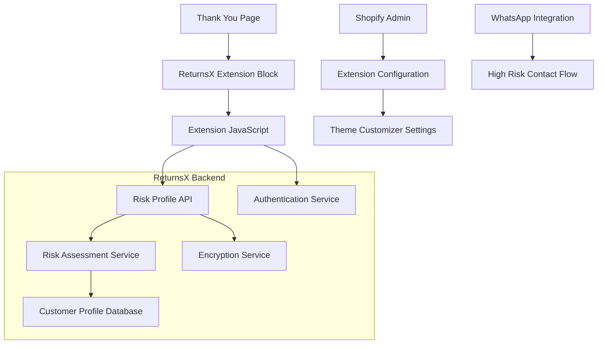

# Design Document

## Overview

The Thank You Page Extension for ReturnsX is a Shopify checkout UI extension that displays customer risk assessment information on the order confirmation page. The extension integrates with ReturnsX's existing risk scoring API to provide real-time customer risk information in a user-friendly, mobile-responsive format.

The extension targets the `purchase.thank-you.block.render` extension point, making it compatible with all payment methods including COD (Cash on Delivery), which is crucial for the Pakistani e-commerce market that ReturnsX serves.

## Architecture

### System Components



### Extension Architecture

The extension follows Shopify's UI Extension architecture with these key components:

1. **Extension Entry Point**: React component that renders the risk assessment UI
2. **API Client**: Handles secure communication with ReturnsX risk profile API
3. **UI Components**: Responsive components for displaying risk information
4. **Configuration System**: Theme customizer integration for merchant settings
5. **Error Handling**: Comprehensive error boundaries and fallback states

## Components and Interfaces

### 1. Extension Configuration Interface

```typescript
interface ExtensionConfig {
  apiEndpoint: string;           // ReturnsX API base URL
  enableDebugMode: boolean;      // Show debug information
  showDetailedTips: boolean;     // Display improvement recommendations
  customMessages: {
    zeroRisk: string;           // Custom message for zero risk customers
    mediumRisk: string;         // Custom message for medium risk customers
    highRisk: string;           // Custom message for high risk customers
  };
  whatsappConfig: {
    enabled: boolean;           // Enable WhatsApp integration
    phoneNumber: string;        // Merchant WhatsApp number
    messageTemplate: string;    // Template for WhatsApp messages
  };
  styling: {
    showRiskScore: boolean;     // Display numerical risk score
    useColorCoding: boolean;    // Use color-coded risk indicators
    compactMode: boolean;       // Use compact display format
  };
}
```

### 2. Risk Profile API Interface

```typescript
interface RiskProfileRequest {
  phone?: string;               // Customer phone number
  email?: string;               // Customer email address
  orderId?: string;             // Current order ID for context
  checkoutToken?: string;       // Shopify checkout token
}

interface RiskProfileResponse {
  success: boolean;
  riskTier: 'ZERO_RISK' | 'MEDIUM_RISK' | 'HIGH_RISK';
  riskScore: number;            // 0-100 risk score
  totalOrders: number;
  failedAttempts: number;
  successfulDeliveries: number;
  isNewCustomer: boolean;
  message: string;              // User-friendly risk message
  recommendations?: string[];    // Improvement tips
  whatsappContact?: {
    enabled: boolean;
    phoneNumber: string;
    messageTemplate: string;
  };
  error?: string;               // Error message if success is false
}
```

### 3. Extension UI Components

#### Main Risk Assessment Card
```typescript
interface RiskAssessmentCardProps {
  riskProfile: RiskProfileResponse;
  config: ExtensionConfig;
  onWhatsAppContact?: () => void;
}
```

#### Risk Tier Indicator
```typescript
interface RiskTierIndicatorProps {
  riskTier: 'ZERO_RISK' | 'MEDIUM_RISK' | 'HIGH_RISK';
  riskScore?: number;
  showScore: boolean;
  useColorCoding: boolean;
}
```

#### Recommendations List
```typescript
interface RecommendationsListProps {
  recommendations: string[];
  riskTier: string;
  compactMode: boolean;
}
```

## Data Models

### 1. Customer Risk Profile

The extension consumes data from ReturnsX's existing customer profile model:

```typescript
interface CustomerProfile {
  id: string;
  phone: string;                // Hashed for privacy
  email: string;                // Hashed for privacy
  totalOrders: number;
  failedAttempts: number;
  successfulDeliveries: number;
  returnRate: number;           // Decimal percentage
  riskScore: number;            // Calculated risk score (0-100)
  riskTier: RiskTier;
  lastEventAt: Date;
  createdAt: Date;
  updatedAt: Date;
}
```

### 2. Extension Settings

Settings stored in Shopify's theme customizer:

```typescript
interface ExtensionSettings {
  apiEndpoint: string;
  authToken: string;            // Encrypted authentication token
  displaySettings: {
    showRiskScore: boolean;
    showRecommendations: boolean;
    useCompactMode: boolean;
    enableColorCoding: boolean;
  };
  messaging: {
    zeroRiskMessage: string;
    mediumRiskMessage: string;
    highRiskMessage: string;
    newCustomerMessage: string;
    errorMessage: string;
  };
  whatsappIntegration: {
    enabled: boolean;
    phoneNumber: string;
    messageTemplate: string;
  };
}
```

## Error Handling

### 1. API Error Handling

```typescript
enum ErrorType {
  NETWORK_ERROR = 'NETWORK_ERROR',
  AUTHENTICATION_ERROR = 'AUTHENTICATION_ERROR',
  INVALID_RESPONSE = 'INVALID_RESPONSE',
  TIMEOUT_ERROR = 'TIMEOUT_ERROR',
  CONFIGURATION_ERROR = 'CONFIGURATION_ERROR'
}

interface ErrorState {
  type: ErrorType;
  message: string;
  retryable: boolean;
  fallbackData?: Partial<RiskProfileResponse>;
}
```

### 2. Graceful Degradation Strategy

1. **API Unavailable**: Display welcome message for new customers
2. **Authentication Failure**: Show generic risk information without personalization
3. **Network Timeout**: Display cached data if available, otherwise show fallback
4. **Invalid Configuration**: Silently disable extension without breaking checkout
5. **JavaScript Errors**: Catch all errors and prevent checkout interruption

### 3. Error Recovery Mechanisms

- **Retry Logic**: Automatic retry for transient network errors (max 3 attempts)
- **Exponential Backoff**: Increasing delays between retry attempts
- **Circuit Breaker**: Disable API calls temporarily after repeated failures
- **Fallback Content**: Always provide meaningful content even when API fails

## Testing Strategy

### 1. Unit Testing

**Components to Test:**
- Risk assessment card rendering with different risk tiers
- API client error handling and retry logic
- Configuration validation and sanitization
- WhatsApp integration URL generation
- Responsive design breakpoints

**Test Scenarios:**
```typescript
describe('RiskAssessmentCard', () => {
  it('renders zero risk customer correctly');
  it('renders medium risk customer with recommendations');
  it('renders high risk customer with WhatsApp contact');
  it('handles missing customer data gracefully');
  it('displays error states appropriately');
  it('respects configuration settings');
});
```

### 2. Integration Testing

**API Integration Tests:**
- Successful risk profile retrieval
- Authentication token validation
- Error response handling
- Timeout scenarios
- Rate limiting behavior

**Shopify Integration Tests:**
- Extension installation and configuration
- Theme customizer settings persistence
- Checkout flow integration
- Mobile responsiveness
- Cross-browser compatibility

### 3. End-to-End Testing

**User Journey Tests:**
1. **New Customer Journey**: First-time customer sees welcome message
2. **Returning Customer Journey**: Existing customer sees personalized risk information
3. **High-Risk Customer Journey**: High-risk customer sees contact options
4. **Error Scenarios**: Extension gracefully handles various error conditions
5. **Mobile Experience**: All functionality works on mobile devices

**Test Data Scenarios:**
```typescript
const testScenarios = [
  {
    name: 'Zero Risk Customer',
    phone: '+923001234567',
    expectedRiskTier: 'ZERO_RISK',
    expectedMessage: 'Trusted customer'
  },
  {
    name: 'High Risk Customer',
    phone: '+923001234560',
    expectedRiskTier: 'HIGH_RISK',
    expectedWhatsApp: true
  },
  {
    name: 'New Customer',
    phone: '+923009999999',
    expectedNewCustomer: true
  }
];
```

### 4. Performance Testing

**Metrics to Monitor:**
- API response time (target: < 500ms)
- Extension load time (target: < 200ms)
- Memory usage during rendering
- Network request efficiency
- Mobile performance on slow connections

**Load Testing:**
- Concurrent API requests handling
- Rate limiting behavior under load
- Database query performance
- Caching effectiveness

### 5. Security Testing

**Security Validations:**
- Authentication token security
- Customer data privacy protection
- XSS prevention in user-generated content
- CSRF protection for API calls
- Input validation and sanitization

**Privacy Compliance:**
- Verify no raw PII is transmitted
- Confirm data hashing implementation
- Test GDPR compliance features
- Validate data retention policies

## Implementation Phases

### Phase 1: Core Extension Development
1. Create Shopify UI extension structure
2. Implement basic risk assessment card component
3. Integrate with existing ReturnsX API
4. Add theme customizer configuration
5. Implement error handling and fallbacks

### Phase 2: Enhanced Features
1. Add WhatsApp integration for high-risk customers
2. Implement responsive design optimizations
3. Add detailed recommendations display
4. Create comprehensive configuration options
5. Implement caching and performance optimizations

### Phase 3: Testing and Optimization
1. Comprehensive unit and integration testing
2. End-to-end user journey testing
3. Performance optimization and monitoring
4. Security audit and compliance validation
5. Documentation and deployment guides

### Phase 4: Production Deployment
1. Production API endpoint configuration
2. Merchant onboarding documentation
3. Support and troubleshooting guides
4. Analytics and monitoring setup
5. Feedback collection and iteration planning

## Security Considerations

### 1. Data Privacy
- All customer identifiers (phone, email) are hashed before API transmission
- No raw PII is stored or transmitted by the extension
- Compliance with GDPR and Pakistani data protection regulations
- Secure token-based authentication for API access

### 2. Authentication Security
- JWT-based session tokens with expiration
- HMAC signature validation for API requests
- Rate limiting to prevent abuse
- Secure storage of authentication credentials

### 3. Client-Side Security
- Input validation and sanitization
- XSS prevention in dynamic content
- Secure handling of configuration data
- Protection against injection attacks

## Performance Optimization

### 1. API Performance
- Response caching for repeated requests
- Optimized database queries with proper indexing
- Connection pooling for database access
- CDN integration for static assets

### 2. Extension Performance
- Lazy loading of non-critical components
- Efficient React rendering with proper memoization
- Minimal bundle size through tree shaking
- Progressive enhancement for slower connections

### 3. Mobile Optimization
- Responsive design with mobile-first approach
- Touch-friendly interface elements
- Optimized images and assets for mobile
- Efficient network usage on cellular connections

## Monitoring and Analytics

### 1. Extension Usage Metrics
- Extension load success rate
- API call success/failure rates
- User interaction patterns
- Error occurrence frequency

### 2. Business Impact Metrics
- Customer engagement with risk information
- WhatsApp contact conversion rates
- Impact on order completion rates
- Merchant satisfaction scores

### 3. Technical Performance Metrics
- API response times
- Extension rendering performance
- Error rates by category
- Mobile vs desktop usage patterns