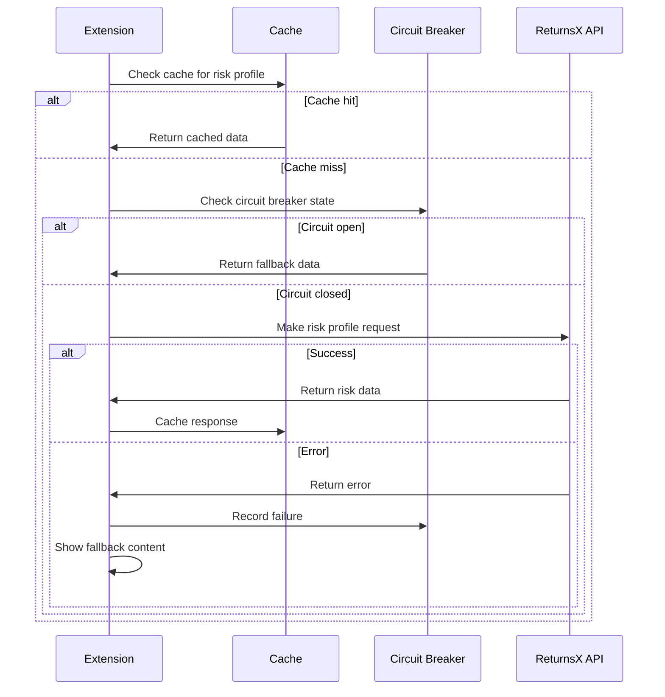

# Developer Documentation - ReturnsX Thank You Page Extension

## Overview

This documentation provides technical details for developers working with the ReturnsX Thank You Page Extension. It covers architecture, customization options, API integration, and development workflows.

## Architecture Overview

### Extension Structure

```
extensions/thank-you-risk-display/
├── src/
│   ├── components/          # React UI components
│   ├── hooks/              # Custom React hooks
│   ├── services/           # API and business logic
│   ├── types/              # TypeScript type definitions
│   ├── utils/              # Utility functions
│   └── Checkout.tsx        # Main extension entry point
├── docs/                   # Documentation files
├── shopify.extension.toml  # Extension configuration
├── package.json           # Dependencies and scripts
├── tsconfig.json          # TypeScript configuration
└── vitest.config.ts       # Test configuration
```

### Technology Stack

- **Framework**: React 18 with TypeScript
- **Build Tool**: Vite with Shopify CLI integration
- **Testing**: Vitest with React Testing Library
- **Styling**: CSS Modules with Shopify Polaris tokens
- **API Client**: Custom fetch-based client with retry logic
- **State Management**: React hooks with context for global state

### Extension Points

The extension targets the `purchase.thank-you.block.render` extension point:

```toml
# shopify.extension.toml
[[extensions]]
type = "checkout_ui_extension"
name = "thank-you-risk-display"

[extensions.targeting]
target = "purchase.thank-you.block.render"
```

## Component Architecture

### Core Components

#### 1. Checkout.tsx (Entry Point)
```typescript
// Main extension component that orchestrates the entire flow
export default function Checkout() {
  const config = useExtensionConfig();
  const customerData = useCustomerData();
  const { riskProfile, loading, error } = useRiskProfile(customerData);
  
  return (
    <ErrorBoundary>
      <RiskAssessmentCard 
        riskProfile={riskProfile}
        config={config}
        loading={loading}
        error={error}
      />
    </ErrorBoundary>
  );
}
```

#### 2. RiskAssessmentCard
```typescript
// Main display component for risk information
interface RiskAssessmentCardProps {
  riskProfile: RiskProfileResponse | null;
  config: ExtensionConfig;
  loading: boolean;
  error: Error | null;
}

export function RiskAssessmentCard(props: RiskAssessmentCardProps) {
  // Handles display logic, error states, and user interactions
}
```

#### 3. Component Hierarchy
```
Checkout
├── ErrorBoundary
│   └── RiskAssessmentCard
│       ├── LoadingStates
│       ├── ErrorStates
│       ├── RiskTierIndicator
│       ├── CustomerStatistics
│       ├── MessageDisplay
│       ├── RecommendationsList
│       └── WhatsAppContact
```

### Custom Hooks

#### useExtensionConfig
```typescript
// Loads and validates extension configuration from theme customizer
export function useExtensionConfig(): ExtensionConfig {
  const settings = useSettings();
  
  return useMemo(() => ({
    apiEndpoint: settings.api_endpoint || DEFAULT_API_ENDPOINT,
    authToken: settings.auth_token,
    debugMode: settings.debug_mode || false,
    // ... other configuration options
  }), [settings]);
}
```

#### useRiskProfile
```typescript
// Manages risk profile data fetching with caching and error handling
export function useRiskProfile(customerData: CustomerData) {
  const [state, setState] = useState<RiskProfileState>({
    data: null,
    loading: false,
    error: null
  });
  
  // Implements caching, retry logic, and circuit breaker pattern
}
```

#### useCustomerData
```typescript
// Extracts and hashes customer data from Shopify checkout
export function useCustomerData(): CustomerData {
  const checkout = useApi().checkout;
  
  return useMemo(() => ({
    phone: checkout.shippingAddress?.phone ? hashPhone(checkout.shippingAddress.phone) : null,
    email: checkout.email ? hashEmail(checkout.email) : null,
    orderId: checkout.order?.id,
    checkoutToken: checkout.token
  }), [checkout]);
}
```

## API Integration

### API Client Architecture

```typescript
// services/apiClient.ts
export class ReturnsXApiClient {
  private baseUrl: string;
  private authToken: string;
  private circuitBreaker: CircuitBreaker;
  private cache: CacheService;
  
  constructor(config: ApiConfig) {
    this.baseUrl = config.baseUrl;
    this.authToken = config.authToken;
    this.circuitBreaker = new CircuitBreaker(config.circuitBreakerOptions);
    this.cache = new CacheService(config.cacheOptions);
  }
  
  async getRiskProfile(request: RiskProfileRequest): Promise<RiskProfileResponse> {
    // Implementation with retry logic, caching, and error handling
  }
}
```

### Request/Response Flow



### Error Handling Strategy

```typescript
// Error handling hierarchy
export enum ErrorType {
  NETWORK_ERROR = 'NETWORK_ERROR',
  AUTHENTICATION_ERROR = 'AUTHENTICATION_ERROR',
  RATE_LIMIT_ERROR = 'RATE_LIMIT_ERROR',
  VALIDATION_ERROR = 'VALIDATION_ERROR',
  TIMEOUT_ERROR = 'TIMEOUT_ERROR',
  UNKNOWN_ERROR = 'UNKNOWN_ERROR'
}

export class ApiError extends Error {
  constructor(
    public type: ErrorType,
    message: string,
    public statusCode?: number,
    public retryable: boolean = false
  ) {
    super(message);
  }
}
```

## Customization Guide

### Theme Integration

#### CSS Custom Properties
```css
/* Available CSS custom properties for styling */
:root {
  --returnsx-primary-color: #007bff;
  --returnsx-success-color: #28a745;
  --returnsx-warning-color: #ffc107;
  --returnsx-danger-color: #dc3545;
  --returnsx-border-radius: 8px;
  --returnsx-font-family: inherit;
  --returnsx-font-size-base: 14px;
  --returnsx-spacing-unit: 8px;
}
```

#### Component Styling
```css
/* Component-specific styling classes */
.returnsx-risk-display {
  /* Main container styles */
}

.returnsx-risk-display__header {
  /* Header section styles */
}

.returnsx-risk-display__content {
  /* Content area styles */
}

.returnsx-risk-display__footer {
  /* Footer/action area styles */
}

/* Risk tier specific styles */
.returnsx-risk-display--zero-risk {
  /* Zero risk customer styling */
}

.returnsx-risk-display--medium-risk {
  /* Medium risk customer styling */
}

.returnsx-risk-display--high-risk {
  /* High risk customer styling */
}
```

### Configuration Schema

#### Extension Settings Schema
```typescript
// Types for extension configuration
export interface ExtensionConfig {
  // API Configuration
  apiEndpoint: string;
  authToken: string;
  requestTimeout: number;
  debugMode: boolean;
  
  // Display Settings
  showRiskScore: boolean;
  useColorCoding: boolean;
  showDetailedTips: boolean;
  compactMode: boolean;
  
  // Message Customization
  customMessages: {
    zeroRisk: string;
    mediumRisk: string;
    highRisk: string;
    newCustomer: string;
    errorFallback: string;
  };
  
  // WhatsApp Integration
  whatsappConfig: {
    enabled: boolean;
    phoneNumber: string;
    messageTemplate: string;
  };
  
  // Advanced Settings
  caching: {
    enabled: boolean;
    duration: number;
    maxEntries: number;
  };
  
  performance: {
    enableLazyLoading: boolean;
    enableMemoization: boolean;
    bundleOptimization: boolean;
  };
}
```

#### Shopify Extension Configuration
```toml
# shopify.extension.toml - Settings schema
[extensions.settings]

[[extensions.settings.groups]]
name = "API Configuration"

[[extensions.settings.groups.settings]]
key = "api_endpoint"
type = "url"
name = "API Endpoint URL"
info = "ReturnsX API base URL"
default = "https://api.returnsx.com/v1"

[[extensions.settings.groups.settings]]
key = "auth_token"
type = "text"
name = "Authentication Token"
info = "Your ReturnsX API token"

[[extensions.settings.groups]]
name = "Display Settings"

[[extensions.settings.groups.settings]]
key = "show_risk_score"
type = "checkbox"
name = "Show Risk Score"
info = "Display numerical risk percentage"
default = true

# ... additional settings
```

## Development Workflow

### Local Development Setup

1. **Prerequisites**
   ```bash
   # Required tools
   node --version  # v18 or higher
   npm --version   # v8 or higher
   shopify version # Shopify CLI 3.0+
   ```

2. **Project Setup**
   ```bash
   # Clone and setup
   cd extensions/thank-you-risk-display
   npm install
   
   # Start development server
   npm run dev
   
   # Run tests
   npm run test
   npm run test:watch
   ```

3. **Development Commands**
   ```bash
   # Build for production
   npm run build
   
   # Type checking
   npm run typecheck
   
   # Linting
   npm run lint
   npm run lint:fix
   
   # Testing
   npm run test:unit
   npm run test:integration
   npm run test:coverage
   ```

### Testing Strategy

#### Unit Tests
```typescript
// Example unit test structure
describe('RiskAssessmentCard', () => {
  it('renders zero risk customer correctly', () => {
    const mockRiskProfile = createMockRiskProfile('ZERO_RISK');
    render(<RiskAssessmentCard riskProfile={mockRiskProfile} />);
    
    expect(screen.getByText(/trusted customer/i)).toBeInTheDocument();
    expect(screen.getByTestId('risk-indicator')).toHaveClass('risk-zero');
  });
  
  it('handles loading state appropriately', () => {
    render(<RiskAssessmentCard loading={true} />);
    
    expect(screen.getByTestId('loading-spinner')).toBeInTheDocument();
    expect(screen.queryByTestId('risk-content')).not.toBeInTheDocument();
  });
});
```

#### Integration Tests
```typescript
// Example integration test
describe('API Integration', () => {
  it('fetches and displays risk profile successfully', async () => {
    const mockApiResponse = createMockApiResponse();
    mockApiClient.getRiskProfile.mockResolvedValue(mockApiResponse);
    
    render(<Checkout />);
    
    await waitFor(() => {
      expect(screen.getByText(mockApiResponse.message)).toBeInTheDocument();
    });
  });
});
```

#### Test Utilities
```typescript
// Test helper functions
export function createMockRiskProfile(riskTier: RiskTier): RiskProfileResponse {
  return {
    success: true,
    riskTier,
    riskScore: riskTier === 'ZERO_RISK' ? 95 : 65,
    totalOrders: 10,
    failedAttempts: riskTier === 'HIGH_RISK' ? 5 : 1,
    // ... other properties
  };
}

export function createMockExtensionConfig(overrides?: Partial<ExtensionConfig>): ExtensionConfig {
  return {
    apiEndpoint: 'https://api.returnsx.com/v1',
    authToken: 'test_token',
    debugMode: false,
    ...overrides
  };
}
```

### Performance Optimization

#### Code Splitting
```typescript
// Lazy loading for non-critical components
const LazyRecommendationsList = lazy(() => 
  import('./RecommendationsList').then(module => ({
    default: module.RecommendationsList
  }))
);

// Usage with Suspense
<Suspense fallback={<LoadingSpinner />}>
  <LazyRecommendationsList recommendations={recommendations} />
</Suspense>
```

#### Memoization
```typescript
// Optimized component with React.memo
export const RiskTierIndicator = memo(function RiskTierIndicator({
  riskTier,
  riskScore,
  useColorCoding
}: RiskTierIndicatorProps) {
  const indicatorStyle = useMemo(() => ({
    backgroundColor: useColorCoding ? getRiskColor(riskTier) : 'transparent',
    borderColor: useColorCoding ? getRiskColor(riskTier) : '#ccc'
  }), [riskTier, useColorCoding]);
  
  return (
    <div className="risk-indicator" style={indicatorStyle}>
      {/* Component content */}
    </div>
  );
});
```

#### Bundle Optimization
```typescript
// webpack.config.js - Bundle optimization
module.exports = {
  optimization: {
    splitChunks: {
      chunks: 'all',
      cacheGroups: {
        vendor: {
          test: /[\\/]node_modules[\\/]/,
          name: 'vendors',
          chunks: 'all',
        },
        common: {
          name: 'common',
          minChunks: 2,
          chunks: 'all',
        }
      }
    }
  }
};
```

## Security Considerations

### Data Privacy

#### Customer Data Hashing
```typescript
// utils/privacy.ts
import { createHash } from 'crypto';

export function hashPhone(phone: string): string {
  // Normalize phone number format
  const normalized = phone.replace(/\D/g, '');
  
  // Hash with SHA-256
  return createHash('sha256')
    .update(normalized)
    .digest('hex');
}

export function hashEmail(email: string): string {
  // Normalize email format
  const normalized = email.toLowerCase().trim();
  
  // Hash with SHA-256
  return createHash('sha256')
    .update(normalized)
    .digest('hex');
}
```

#### Input Sanitization
```typescript
// utils/sanitization.ts
export function sanitizeMessage(message: string): string {
  return message
    .replace(/<script\b[^<]*(?:(?!<\/script>)<[^<]*)*<\/script>/gi, '') // Remove scripts
    .replace(/javascript:/gi, '') // Remove javascript: URLs
    .replace(/on\w+\s*=/gi, '') // Remove event handlers
    .trim()
    .substring(0, 500); // Limit length
}

export function validatePhoneNumber(phone: string): boolean {
  const phoneRegex = /^\+[1-9]\d{1,14}$/;
  return phoneRegex.test(phone);
}
```

### API Security

#### Request Authentication
```typescript
// services/authService.ts
export class AuthService {
  private static instance: AuthService;
  private tokenCache: Map<string, { token: string; expiresAt: number }> = new Map();
  
  async getValidToken(apiKey: string): Promise<string> {
    const cached = this.tokenCache.get(apiKey);
    
    if (cached && cached.expiresAt > Date.now()) {
      return cached.token;
    }
    
    // Refresh token logic
    const newToken = await this.refreshToken(apiKey);
    this.tokenCache.set(apiKey, {
      token: newToken,
      expiresAt: Date.now() + (55 * 60 * 1000) // 55 minutes
    });
    
    return newToken;
  }
}
```

## Deployment Guide

### Production Build

```bash
# Build optimized production bundle
npm run build

# Verify build output
ls -la dist/

# Test production build locally
npm run preview
```

### Shopify App Store Deployment

1. **Prepare Extension**
   ```bash
   # Validate extension configuration
   shopify app validate
   
   # Generate deployment bundle
   shopify app build
   ```

2. **Submit for Review**
   ```bash
   # Deploy to Shopify Partners
   shopify app deploy
   
   # Submit for App Store review
   shopify app submit
   ```

### Version Management

```json
// package.json - Version configuration
{
  "name": "@returnsx/thank-you-extension",
  "version": "1.0.0",
  "scripts": {
    "version:patch": "npm version patch",
    "version:minor": "npm version minor",
    "version:major": "npm version major"
  }
}
```

## Monitoring and Analytics

### Performance Monitoring

```typescript
// services/performanceMonitor.ts
export class PerformanceMonitor {
  static trackApiCall(endpoint: string, duration: number, success: boolean) {
    // Send metrics to analytics service
    analytics.track('api_call', {
      endpoint,
      duration,
      success,
      timestamp: Date.now()
    });
  }
  
  static trackComponentRender(componentName: string, renderTime: number) {
    // Track component performance
    analytics.track('component_render', {
      component: componentName,
      renderTime,
      timestamp: Date.now()
    });
  }
}
```

### Error Tracking

```typescript
// services/errorTracker.ts
export class ErrorTracker {
  static captureError(error: Error, context?: Record<string, any>) {
    // Send error to monitoring service
    errorReporting.captureException(error, {
      tags: {
        component: 'thank-you-extension',
        version: process.env.EXTENSION_VERSION
      },
      extra: context
    });
  }
  
  static captureMessage(message: string, level: 'info' | 'warning' | 'error') {
    errorReporting.captureMessage(message, level);
  }
}
```

## Contributing Guidelines

### Code Standards

1. **TypeScript**: All code must be written in TypeScript with strict mode enabled
2. **Testing**: Minimum 80% code coverage required
3. **Linting**: Code must pass ESLint and Prettier checks
4. **Documentation**: All public APIs must be documented with JSDoc

### Pull Request Process

1. **Branch Naming**: `feature/description` or `fix/description`
2. **Commit Messages**: Follow conventional commits format
3. **Testing**: All tests must pass
4. **Review**: Requires approval from at least one maintainer

### Development Environment

```bash
# Setup development environment
git clone <repository>
cd extensions/thank-you-risk-display
npm install
npm run dev

# Run quality checks
npm run lint
npm run typecheck
npm run test
```

## API Reference

### Extension Hooks

#### useExtensionConfig()
Returns the current extension configuration from theme customizer.

**Returns**: `ExtensionConfig`

#### useRiskProfile(customerData)
Fetches and manages risk profile data for a customer.

**Parameters**:
- `customerData: CustomerData` - Customer identification data

**Returns**: `{ riskProfile, loading, error, refetch }`

#### useCustomerData()
Extracts customer data from Shopify checkout context.

**Returns**: `CustomerData`

### Utility Functions

#### hashPhone(phone: string): string
Hashes a phone number for privacy-safe API transmission.

#### hashEmail(email: string): string  
Hashes an email address for privacy-safe API transmission.

#### sanitizeMessage(message: string): string
Sanitizes user-provided messages to prevent XSS attacks.

#### validateConfiguration(config: ExtensionConfig): ValidationResult
Validates extension configuration for completeness and correctness.

## Support and Resources

### Documentation Links
- [Shopify UI Extensions](https://shopify.dev/docs/apps/checkout/ui-extensions)
- [React Documentation](https://react.dev/)
- [TypeScript Handbook](https://www.typescriptlang.org/docs/)
- [Vitest Documentation](https://vitest.dev/)

### Community Resources
- **GitHub Repository**: [Link to repository]
- **Discord Community**: [Link to Discord]
- **Stack Overflow**: Tag questions with `returnsx-extension`

### Getting Help
- **Technical Issues**: Create GitHub issue with reproduction steps
- **Feature Requests**: Submit feature request through GitHub discussions
- **Security Issues**: Email security@returnsx.com directly

### Changelog
See [CHANGELOG.md](../CHANGELOG.md) for version history and breaking changes.